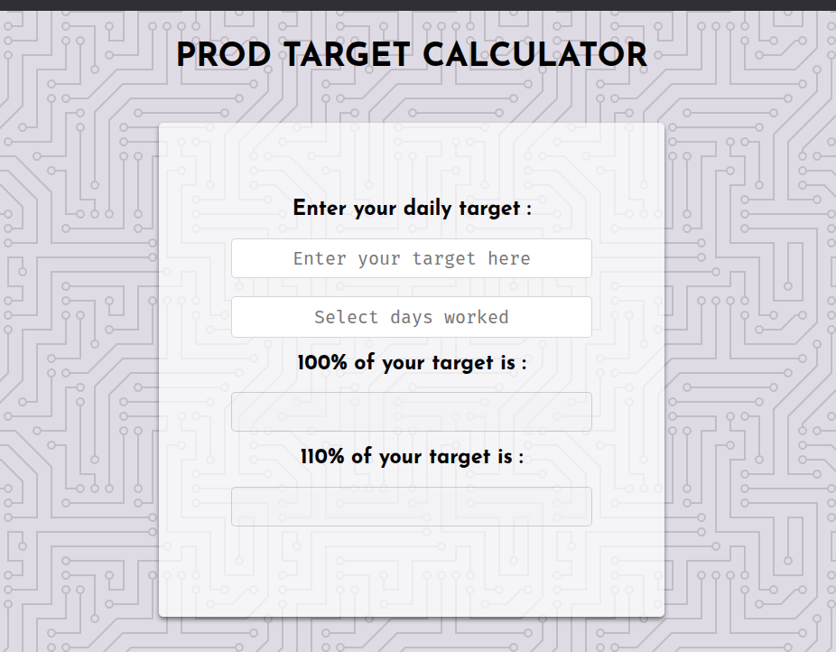

# Monthly Target Calculator



A simple web app that calculates the monthly target based on the number of days worked in a specific month. The app includes a custom date picker and calculates both the **100%** and **110%** target values.

---

## Table of Contents

- [Introduction](#introduction)
- [Features](#features)
- [How to Use](#how-to-use)
- [Installation](#installation)
- [Technologies Used](#technologies-used)

---

## Introduction

The **Monthly Target Calculator** is a web application designed to help users calculate their monthly work targets based on the number of days they worked in a specific month. The app includes:

- A **custom date picker** to select the month and year.
- Two **text inputs** to calculate the 100% and 110% target values.

This app is built using **HTML**, **CSS**, and **JavaScript**, and it does not rely on any external libraries or frameworks.

---

## Features

- **Custom Date Picker**: Select the month and year to calculate the number of days worked.
- **Target Calculation**:
  - Enter the number of days worked.
  - Automatically calculates the **100%** and **110%** target values.
- **Responsive Design**: Works seamlessly on both desktop and mobile devices.
- **Simple and Intuitive**: Easy-to-use interface for quick calculations.

---

## How to Use

1. **Enter daily target**:

   - Use the custom date picker to select the month and year you want to calculate the target for.

2. **use date picker to select days worked **:

   - click on the days you worked using the datePicker .

3. **View Results**:
   - The app will automatically calculate and display:
     - **100% Target**: The base target for the month.
     - **110% Target**: The target with a 10% increase.

---

## Installation

To run this project locally, follow these steps:

1. **Clone the Repository**:

   ```bash
   git clone https://github.com/shadythegiant/monthly-target-calculator.git
   ```

2. **Navigate to the Project Directory**:

   ```bash
   cd monthly-target-calculator
   ```

3. **Open the App**:
   - Open the `index.html` file in your preferred web browser.
   - Alternatively, use a local server (e.g., Live Server in VS Code) to run the app.

---

## Technologies Used

- **HTML**: For structuring the app.
- **CSS**: For styling the app and making it responsive.
- **JavaScript**: For handling the logic and calculations.
- **Custom Date Picker**: Built from scratch using JavaScript / CSS.

---
